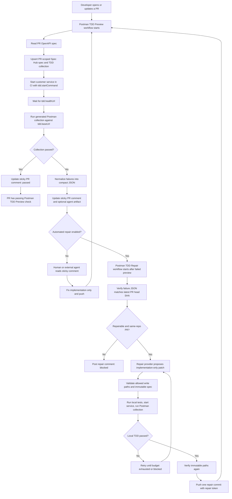

# Postman Onboarding TDD

`postman-onboarding-tdd` is a GitHub Action that turns an OpenAPI change in a pull request into a runnable Postman TDD check.

For each PR, the action:

1. Reads the PR version of your OpenAPI spec.
2. Creates or updates one PR-scoped Spec Hub spec and one generated TDD contract collection in a shared Postman workspace.
3. Starts your service in CI using the command you provide.
4. Runs the generated collection against your local CI service URL.
5. Posts a sticky PR comment with a human-readable summary and compact JSON that coding agents can use.

The optional repair worker can also call a configured AI repair provider, make implementation-only changes, run the same Postman collection locally, and push one repair commit only after the local TDD run passes.

## End-To-End Flow



## What Customers Configure

You add three things to the service repository:

1. `.postman-template/onboarding.yml`
2. One script that starts the service for CI TDD
3. Optional setup-check workflow plus one or two GitHub workflows, or the combined preview-plus-repair workflow while testing repair from a PR branch

For most teams, start with the setup-check and preview workflows first. Add the automated repair workflow after the preview check is stable.

## Quick Start

1. Copy the sample config into the service repository:

   ```bash
   mkdir -p .postman-template
   curl -fsSL https://raw.githubusercontent.com/postman-cs/postman-onboarding-tdd/main/.postman-template/onboarding.yml \
     -o .postman-template/onboarding.yml
   ```

   If your environment cannot access the raw GitHub URL, copy `.postman-template/onboarding.yml` from a local checkout of this repository. If the package is installed locally, the same sample is available at `node_modules/@postman-cse/onboarding-tdd/.postman-template/onboarding.yml`.

2. Edit `.postman-template/onboarding.yml`:

   - set `spec.path` to the service OpenAPI file,
   - set `service.name`,
   - set `tdd.workspace.name`,
   - set `tdd.baseUrl`, `tdd.healthUrl`, and `tdd.startCommand`,
   - keep `tdd.repair.enabled: false` until the preview workflow is stable, then enable repair.

3. Optionally copy the no-secrets setup-check workflow:

   ```bash
   mkdir -p .github/workflows
   curl -fsSL https://raw.githubusercontent.com/postman-cs/postman-onboarding-tdd/main/.postman-template/workflows/postman-tdd-validate.yml \
     -o .github/workflows/postman-tdd-validate.yml
   ```

   This workflow runs `mode: validate` and checks the onboarding config, OpenAPI spec, simple script paths, repair path policy, and obvious duplicate workflow choices without using Postman, GitHub, or AI provider secrets.

4. Copy the packaged preview workflow:

   ```bash
   mkdir -p .github/workflows
   curl -fsSL https://raw.githubusercontent.com/postman-cs/postman-onboarding-tdd/main/.postman-template/workflows/postman-tdd-preview.yml \
     -o .github/workflows/postman-tdd-preview.yml
   ```

   Then adjust the workflow `paths` list for the service if needed.

5. Add the required secrets from [GitHub Secrets](#github-secrets).

6. Open a PR that changes the OpenAPI spec or implementation and confirm `Postman TDD Setup Check` and `Postman TDD Preview` pass or post actionable failures.

7. Enable repair using [Repair Setup Checklist](#repair-setup-checklist).

## Repository Config

Create or update `.postman-template/onboarding.yml`. A complete sample is packaged at `.postman-template/onboarding.yml` in this repository:

```yaml
version: 1

spec:
  path: api/openapi.yaml

service:
  name: reference-service

tdd:
  enabled: true
  workspace:
    name: Reference Service - TDD Preview
    # id is optional on the first run.
    # The action can create/find the workspace and write the id back.
    # id: 00000000-0000-0000-0000-000000000000
  baseUrl: http://127.0.0.1:4010
  healthUrl: http://127.0.0.1:4010/v1/health
  startCommand: ./scripts/postman-tdd-start.sh
  stopCommand: ./scripts/postman-tdd-stop.sh # optional
  timeoutSeconds: 90
  repair:
    enabled: false
    provider: openai-responses
    maxAttempts: 3
    allowedWritePaths:
      - src/**
    allowedReadPaths:
      - src/**
      - test/**
      - package.json
    localTestCommand: npm test # optional
```

`startCommand` is customer-owned. It must make the PR implementation reachable at `baseUrl`. It can run the app directly, start Docker Compose, launch mocks, seed data, or do whatever the service needs in CI.

The action runs `startCommand`, `stopCommand`, and repair `localTestCommand` with a sanitized environment. GitHub Action `INPUT_*` values and token-, secret-, password-, API-key-, access-key-, and private-key-like variables are removed before customer-owned commands start.

This is how the action stays language- and framework-neutral. Java, Node.js, C#, Python, Docker Compose, and multi-service repos all use the same contract: provide one command that starts the PR implementation locally.

If `tdd.workspace.id` is missing, the action:

1. Looks for exactly one Postman workspace with `tdd.workspace.name`.
2. Creates the workspace if none exists.
3. Fails if multiple exact-name workspaces exist.
4. Writes the workspace ID back to `onboarding.yml` unless `config-write-mode` is `none`.

If the repository does not allow workflow commits back to PR branches, set `config-write-mode: none` and add `tdd.workspace.id` manually after the first workspace is created.

## GitHub Secrets

Create these secrets in the customer service repository:

| Secret | Required | Purpose |
| --- | --- | --- |
| `POSTMAN_API_KEY` | yes | Creates/updates Postman workspace, spec, collection, and runs the collection. |
| `POSTMAN_ACCESS_TOKEN` | repair with Postman Agent Mode | Used when the resolved repair provider is `postman-agent-mode`. |
| `POSTMAN_TDD_SIGNING_KEY` | recommended | Signs the immutable-spec baseline so agents cannot tamper with sticky comment state. |
| `OPENAI_API_KEY` | repair with OpenAI | Used when the resolved repair provider is `openai-responses`. |
| `ANTHROPIC_API_KEY` | repair with Claude | Used when the resolved repair provider is `anthropic-messages`. |
| `POSTMAN_TDD_REPAIR_TOKEN` | repair recommended | PAT or GitHub App token used to push repair commits and trigger the next preview run. |

Use a long random value for `POSTMAN_TDD_SIGNING_KEY`. Implementation agents should not be able to read it.

`POSTMAN_TDD_REPAIR_TOKEN` should be a token that can push to PR branches. A normal `GITHUB_TOKEN` push may not trigger the follow-up workflow run, so production repair should use a PAT or GitHub App token.

## Repair Setup Checklist

Use this checklist after the preview workflow is already posting `Postman TDD Preview` comments.

1. In `.postman-template/onboarding.yml`, enable repair and choose a provider:

   ```yaml
   tdd:
     repair:
       enabled: true
       provider: anthropic-messages # or openai-responses or postman-agent-mode
       maxAttempts: 3
       allowedWritePaths:
         - src/**
       allowedReadPaths:
         - src/**
         - test/**
         - package.json
       localTestCommand: npm test
   ```

   Supported provider values are `openai-responses`, `anthropic-messages`, and `postman-agent-mode`.

2. Keep `allowedWritePaths` narrow. These are the only implementation paths the repair worker may patch. Do not include the OpenAPI spec, generated Postman files, workflow files, or secret-like files.

3. Add provider credentials:

   | Provider | Config value | Workflow input | Secret |
   | --- | --- | --- | --- |
   | OpenAI Responses | `openai-responses` | `openai-api-key` | `OPENAI_API_KEY` |
   | Anthropic Messages | `anthropic-messages` | `anthropic-api-key` | `ANTHROPIC_API_KEY` |
   | Postman Agent Mode | `postman-agent-mode` | `postman-access-token` | `POSTMAN_ACCESS_TOKEN` |

4. Add `POSTMAN_TDD_REPAIR_TOKEN` so pushed repair commits can trigger the next preview run.

5. Copy the packaged repair workflow from [Repair Workflow](#repair-workflow) for a default-branch production setup. To test repair before merging the production `workflow_run` workflow, use [Branch-Testable Preview + Repair Workflow](#branch-testable-preview--repair-workflow). You can omit the action `repair-provider` input to use `tdd.repair.provider` from onboarding config. If you set the action input, it must match the config value.

6. Test repair with a small implementation-only contract failure. Done means the PR shows both `Postman TDD Repair (REPAIRED)` and a later `Postman TDD Preview (PASSED)` on the repair commit.

## Setup Validation Workflow

Copy the packaged setup-check workflow into the service repository:

```bash
mkdir -p .github/workflows
curl -fsSL https://raw.githubusercontent.com/postman-cs/postman-onboarding-tdd/main/.postman-template/workflows/postman-tdd-validate.yml \
  -o .github/workflows/postman-tdd-validate.yml
```

If you have this package checked out or installed locally, the same template is available at `.postman-template/workflows/postman-tdd-validate.yml`.

The packaged template contains:

```yaml
name: Postman TDD Setup Check

on:
  pull_request:
    types: [opened, synchronize, reopened]
    paths:
      - api/**
      - scripts/postman-tdd-start.sh
      - scripts/postman-tdd-stop.sh
      - .postman-template/onboarding.yml
      - .github/workflows/postman-tdd-validate.yml

permissions:
  contents: read

concurrency:
  group: postman-tdd-validate-pr-${{ github.event.pull_request.number }}
  cancel-in-progress: true

jobs:
  validate:
    runs-on: ubuntu-latest
    steps:
      - uses: actions/checkout@v5
        with:
          ref: ${{ github.head_ref }}

      - uses: postman-cs/postman-onboarding-tdd@v0
        with:
          mode: validate
```

`mode: validate` does not call Postman APIs, install or authenticate the Postman CLI, post GitHub comments, call AI providers, or require repository secrets. It checks the onboarding config, OpenAPI parseability and operations, simple script paths, repair read/write path safety, and obvious duplicate workflow choices. Complex shell commands such as `npm start` are reported as warnings rather than failures because the action cannot safely parse every customer shell command.

## Preview Workflow

Copy the packaged preview workflow into the service repository:

```bash
mkdir -p .github/workflows
curl -fsSL https://raw.githubusercontent.com/postman-cs/postman-onboarding-tdd/main/.postman-template/workflows/postman-tdd-preview.yml \
  -o .github/workflows/postman-tdd-preview.yml
```

If you have this package checked out or installed locally, the same template is available at `.postman-template/workflows/postman-tdd-preview.yml`.

The packaged template contains:

```yaml
name: Postman TDD Preview

on:
  pull_request:
    types: [opened, synchronize, reopened, closed]
    paths:
      - api/**
      - src/**
      - scripts/postman-tdd-start.sh
      - .postman-template/onboarding.yml
      - .github/workflows/postman-tdd-preview.yml

permissions:
  contents: write
  pull-requests: write
  issues: write

concurrency:
  group: postman-tdd-pr-${{ github.event.pull_request.number }}
  cancel-in-progress: true

jobs:
  tdd:
    if: github.actor != 'github-actions[bot]'
    runs-on: ubuntu-latest
    steps:
      - uses: actions/checkout@v5
        with:
          ref: ${{ github.event.action == 'closed' && github.base_ref || github.head_ref }}
          fetch-depth: 0

      - uses: postman-cs/postman-onboarding-tdd@v0
        with:
          mode: ${{ github.event.action == 'closed' && 'cleanup' || 'run' }}
          postman-api-key: ${{ secrets.POSTMAN_API_KEY }}
          github-token: ${{ secrets.GITHUB_TOKEN }}
          immutable-state-signing-key: ${{ secrets.POSTMAN_TDD_SIGNING_KEY }}
          workspace-team-id: ${{ vars.POSTMAN_WORKSPACE_TEAM_ID }}
```

Adjust the `paths` list to match the customer repository. At minimum, include the OpenAPI spec, implementation code, startup script, and onboarding config.

On normal PR commits, `mode: run` creates/updates the PR-scoped Postman assets and runs the collection. On PR close, `mode: cleanup` deletes the PR-scoped spec and collection.

## PR Feedback

The preview workflow updates one sticky PR comment titled `Postman TDD Preview`.

On success, it records the passing PR head commit.

On failure, it includes:

- failure phase, such as `collection_run`, `service_startup`, or `health_check`,
- the PR commit that produced the failure,
- immutable paths, usually the OpenAPI spec path,
- a phase-aware next action section that explains what happened, what to do next, repair eligibility, and the success condition,
- current failures summarized before the JSON,
- compact failure JSON for humans and agents,
- a pointer to the optional `postman-tdd-agent-context` artifact.

Agents should use the sticky comment first. Artifacts are helpful but not required.

Example compact failure:

```json
{
  "operationId": "createWidget",
  "method": "POST",
  "path": "/v1/widgets",
  "assertion": "response body matches schema",
  "message": "Missing required property: owner"
}
```

The success criterion is always:

```text
The latest PR head commit has a passing GitHub check named Postman TDD Preview.
```

## Agent Instructions

Copy this file from this repository into the customer service repository:

```text
.postman-template/tdd-agent.md
```

Commit it to the default branch, usually `main`, so every future PR inherits the same generic instructions.

A human or agent can then use a very small prompt:

```text
Follow .postman-template/tdd-agent.md for this PR.
```

The instructions tell agents to:

- read the latest `Postman TDD Preview` sticky comment,
- compare the failure JSON `commit` to the current PR head SHA,
- fix implementation code only,
- treat `immutablePaths` as read-only,
- push changes,
- wait for the next preview run,
- stop when the latest PR head commit passes or the failure is genuinely blocked.

Do not commit generated `.postman-tdd/` files. Those are run-specific CI artifacts and can become stale after every commit.

## Immutable Spec Guard

Humans can submit OpenAPI spec changes in a PR. Once the TDD failure exists, implementation repair must treat the PR spec as the contract to satisfy.

The action enforces this at workflow level:

1. The preview run records a hash of `spec.path`.
2. The next preview run compares the current spec hash with the previous failure baseline.
3. If an implementation repair changed the spec, the action fails with `immutable_spec`.
4. If `immutable-state-signing-key` is set, the baseline is signed with HMAC-SHA256. A missing or invalid signature fails with `immutable_state_tampered`.

This message is used when the spec changes during implementation repair:

```text
The OpenAPI spec is immutable during implementation repair. Revert spec changes and fix code only.
```

The action also emits an optional CI artifact:

```text
.postman-tdd/
  agent-task.md
  failures.json
  immutable-spec-guard.mjs
```

Agents that can access the artifact may run:

```bash
node .postman-tdd/immutable-spec-guard.mjs snapshot
node .postman-tdd/immutable-spec-guard.mjs verify
```

If artifacts are unavailable, agents should use the inline failure JSON from the sticky comment.

## Optional Local Agent Policy

This repository includes optional templates for agent runtimes that support pre-tool-use hooks:

```text
.postman-template/agent-policy.json
.postman-template/hooks/codex-pre-tool-use.mjs
.postman-template/codex/hooks.json
```

These files are optional. They are local or harness-level prevention, not the final enforcement layer. The GitHub Action immutable-spec guard remains the required enforcement layer.

For Codex-compatible runtimes that execute project hooks, copy the hook config into the customer repository:

```bash
mkdir -p .codex
cp .postman-template/codex/hooks.json .codex/hooks.json
```

Then verify the runtime actually executes hooks before relying on them.

## Optional Automated Repair Worker

The repair worker is opt-in. It is useful when you want the workflow to attempt implementation repair automatically after a failed preview check.

The fastest setup path is the [Repair Setup Checklist](#repair-setup-checklist). The details below explain the repair boundaries and workflow shape.

Add or enable repair settings in `.postman-template/onboarding.yml`:

```yaml
tdd:
  repair:
    enabled: true
    provider: openai-responses # or anthropic-messages or postman-agent-mode
    maxAttempts: 3
    allowedWritePaths:
      - src/**
    allowedReadPaths:
      - src/**
      - package.json
      - package-lock.json
    localTestCommand: npm test # optional
```

`allowedWritePaths` is required when repair is enabled. Keep it as narrow as possible.

`allowedReadPaths` defaults to `allowedWritePaths` when omitted.

The worker will not write to:

- the OpenAPI spec path,
- `.postman-template/**`,
- `.postman-tdd/**`,
- `.github/workflows/**`,
- generated Postman files,
- secret-like files.

The selected repair model does not receive Postman secrets, GitHub tokens, the canonical spec file content, generated collection content, shell access, git access, or raw filesystem write tools. Claude and Postman Agent Mode repair use the same guarded read/search/patch tools and the same allowed path policy as OpenAI repair mode.

### Repair Workflow

Add a second workflow, `.github/workflows/postman-tdd-repair.yml`:

For `workflow_run` triggers, GitHub uses the workflow definition from the default branch. Merge this repair workflow to the default branch before expecting it to run automatically for PR failures.

Copy the packaged repair workflow into the service repository:

```bash
mkdir -p .github/workflows
curl -fsSL https://raw.githubusercontent.com/postman-cs/postman-onboarding-tdd/main/.postman-template/workflows/postman-tdd-repair.yml \
  -o .github/workflows/postman-tdd-repair.yml
```

If you have this package checked out or installed locally, the same template is available at `.postman-template/workflows/postman-tdd-repair.yml`.

The packaged template contains:

```yaml
name: Postman TDD Repair

on:
  workflow_run:
    workflows: [Postman TDD Preview]
    types: [completed]

permissions:
  contents: write
  pull-requests: write
  issues: write

concurrency:
  group: postman-tdd-repair-${{ github.event.workflow_run.head_branch }}
  cancel-in-progress: true

jobs:
  repair:
    if: >
      github.event.workflow_run.conclusion == 'failure' &&
      github.event.workflow_run.event == 'pull_request' &&
      github.event.workflow_run.pull_requests[0].number
    runs-on: ubuntu-latest
    steps:
      - uses: actions/checkout@v5
        with:
          ref: ${{ github.event.workflow_run.head_branch }}
          fetch-depth: 0

      - uses: postman-cs/postman-onboarding-tdd@v0
        with:
          mode: repair
          pr-number: ${{ github.event.workflow_run.pull_requests[0].number }}
          postman-api-key: ${{ secrets.POSTMAN_API_KEY }}
          github-token: ${{ secrets.GITHUB_TOKEN }}
          repair-github-token: ${{ secrets.POSTMAN_TDD_REPAIR_TOKEN }}
          openai-api-key: ${{ secrets.OPENAI_API_KEY }}
          anthropic-api-key: ${{ secrets.ANTHROPIC_API_KEY }}
          postman-access-token: ${{ secrets.POSTMAN_ACCESS_TOKEN }}
          immutable-state-signing-key: ${{ secrets.POSTMAN_TDD_SIGNING_KEY }}
          repair-max-attempts: 3
          workspace-team-id: ${{ vars.POSTMAN_WORKSPACE_TEAM_ID }}
```

### Branch-Testable Preview + Repair Workflow

Use this template when you want to test automated repair from a PR branch before merging the production `workflow_run` repair workflow to the default branch. It runs preview and repair in one `pull_request` workflow:

- the `tdd` job runs the normal preview action,
- the `repair` job runs only when `tdd` fails and the PR is not closing,
- the repair job checks out `github.head_ref` so it can patch the PR branch,
- the action still reads `tdd.repair.provider` from `.postman-template/onboarding.yml`.

Copy the packaged combined workflow into the service repository:

```bash
mkdir -p .github/workflows
curl -fsSL https://raw.githubusercontent.com/postman-cs/postman-onboarding-tdd/main/.postman-template/workflows/postman-tdd-preview-and-repair.yml \
  -o .github/workflows/postman-tdd-preview-and-repair.yml
```

If you have this package checked out or installed locally, the same template is available at `.postman-template/workflows/postman-tdd-preview-and-repair.yml`.

Do not run the combined workflow alongside the separate preview workflow for normal production use, or a failed PR can trigger duplicate preview runs. After branch testing succeeds, prefer the separate [Preview Workflow](#preview-workflow) plus default-branch [Repair Workflow](#repair-workflow).

The combined workflow wires all provider credential inputs so you can switch providers by changing `tdd.repair.provider` in onboarding config. The selected provider still receives only guarded repair tools and no repository secrets, shell access, broad file writes, generated Postman assets, or Postman workspace mutation tools.

The action uses `tdd.repair.provider` from onboarding config when `repair-provider` is omitted. The packaged repair workflow wires all provider credential inputs to their matching GitHub secrets, but the selected repair provider still receives only guarded repair tools and no repository secrets. You may set `repair-provider` in the workflow as an explicit guard; when set, it must match the onboarding config value.

To use Claude instead, set the onboarding config provider to `anthropic-messages`, pass `anthropic-api-key`, and use a Claude Messages model:

```yaml
        with:
          mode: repair
          pr-number: ${{ github.event.workflow_run.pull_requests[0].number }}
          postman-api-key: ${{ secrets.POSTMAN_API_KEY }}
          github-token: ${{ secrets.GITHUB_TOKEN }}
          repair-github-token: ${{ secrets.POSTMAN_TDD_REPAIR_TOKEN }}
          repair-model: claude-sonnet-5
          anthropic-api-key: ${{ secrets.ANTHROPIC_API_KEY }}
          immutable-state-signing-key: ${{ secrets.POSTMAN_TDD_SIGNING_KEY }}
```

To use Postman Agent Mode instead, set the onboarding config provider to `postman-agent-mode` and pass `postman-access-token`. If `repair-model` is omitted, the action uses the Postman Agent Mode default `GPT_5`.

```yaml
        with:
          mode: repair
          pr-number: ${{ github.event.workflow_run.pull_requests[0].number }}
          postman-api-key: ${{ secrets.POSTMAN_API_KEY }}
          postman-access-token: ${{ secrets.POSTMAN_ACCESS_TOKEN }}
          github-token: ${{ secrets.GITHUB_TOKEN }}
          repair-github-token: ${{ secrets.POSTMAN_TDD_REPAIR_TOKEN }}
          immutable-state-signing-key: ${{ secrets.POSTMAN_TDD_SIGNING_KEY }}
```

The repair worker:

1. Reads the latest preview sticky comment.
2. Blocks if the failure JSON is stale.
3. Blocks fork PRs.
4. Blocks unsupported phases such as config, workspace, immutable-state, or immutable-spec failures.
5. Allows repair for `collection_run`, `service_startup`, and `health_check`.
6. Lets the selected repair provider use guarded read/search/patch/finish tools only.
7. Runs `localTestCommand` when configured.
8. Starts the service and runs the Postman TDD collection locally.
9. Verifies immutable paths and allowed write paths.
10. Pushes one repair commit only after the local Postman collection passes.

The worker posts a separate sticky PR comment titled `Postman TDD Repair`. It does not overwrite the preview comment. The repair comment includes the attempts, blocked reason or commit when available, the original repair message, and a next-action section for skipped, blocked, failed, or repaired outcomes.

When repair accepts one or more implementation patches, the repair comment also includes a compact attempt timeline with the patch summary, touched paths, local test result, local Postman oracle result, and final outcome for each attempt. The full machine-readable repair summary is written to `.postman-tdd/repair-summary.json` and exposed through the `repair-summary-path` output.

Postman Agent Mode repair receives the same guarded repair tool definitions as the other providers: `list_files`, `read_file`, `search_files`, `propose_patch`, and `finish`. The action does not expose broad shell access, arbitrary file write tools, repository secrets, Postman workspace mutation tools, or generic Agent Mode tools to the repair provider.

## Action Inputs

| Input | Required | Default | Description |
| --- | --- | --- | --- |
| `mode` | no | `run` | `validate`, `run`, `cleanup`, or `repair`. |
| `onboarding-config-path` | no | `.postman-template/onboarding.yml` | Service onboarding config path. |
| `project-name` | no | `service.name` | Optional service name override. |
| `spec-path` | no | `spec.path` | Optional OpenAPI spec path override. |
| `pr-number` | no | pull request event number | Optional PR number override. Recommended for `workflow_run` repair workflows. |
| `postman-api-key` | run/cleanup/repair | | Postman API key. Not required for `mode: validate`. |
| `postman-access-token` | repair with Postman Agent Mode | | Postman access token for `mode: repair` when the resolved repair provider is `postman-agent-mode`. Optional otherwise. |
| `github-token` | run/cleanup/repair | | Token for PR comments and workspace ID config writeback. Not required for `mode: validate`. |
| `immutable-state-signing-key` | no | | HMAC key used to sign immutable spec baselines. Recommended value: `${{ secrets.POSTMAN_TDD_SIGNING_KEY }}`. |
| `workspace-team-id` | no | | Numeric Postman sub-team ID for org-mode workspace creation. |
| `config-write-mode` | no | `commit-and-push` | `commit-and-push`, `commit-only`, or `none`. |
| `committer-name` | no | `Postman` | Commit author name for workspace ID writeback. |
| `committer-email` | no | `support@postman.com` | Commit author email for workspace ID writeback. |
| `postman-region` | no | `us` | `us` or `eu`. |
| `postman-stack` | no | `prod` | `prod` or `beta`. |
| `openai-api-key` | repair with OpenAI | | OpenAI API key for `mode: repair` when the resolved repair provider is `openai-responses`. |
| `anthropic-api-key` | repair with Claude | | Anthropic API key for `mode: repair` when the resolved repair provider is `anthropic-messages`. |
| `repair-github-token` | repair recommended | `github-token` | Token used by `mode: repair` for pushing repair commits. Prefer a PAT or GitHub App token. |
| `repair-provider` | no | `tdd.repair.provider` | Optional repair provider guard. One of `openai-responses`, `anthropic-messages`, or `postman-agent-mode`. When omitted, repair uses onboarding config. When set, it must match `tdd.repair.provider`. |
| `repair-model` | no | provider default | Model used by `mode: repair`. Defaults to `gpt-5.5` for OpenAI, `claude-sonnet-5` for Claude, and `GPT_5` for Postman Agent Mode unless explicitly set. |
| `repair-max-attempts` | no | `3` | Maximum accepted implementation patch attempts. |
| `repair-max-tool-rounds` | no | `12` | Per-attempt provider tool-round budget in `mode: repair`. Integer between 1 and 50. |
| `repair-breaker-threshold` | no | `2` | Consecutive identical failure fingerprint count that triggers a `repeated_failure` circuit breaker in `mode: repair`. Integer >= 2. |
| `repair-escalation-model` | no | `tdd.repair.escalationModel` | Optional stronger model for the escalation rung in `mode: repair`. Same provider, one extra attempt after budget exhaustion. |
| `repair-commit-message` | no | `Postman TDD repair` | Commit message used for a passing repair commit. |

### Repair Loop Mechanics (P2)

The repair loop (`mode: repair`) has four anti-thrash and budget mechanics:

1. **Checkpoint resume (D9).** After each attempt, a signed `RepairCheckpointPayload` is written to `.postman-tdd/checkpoint.json` and embedded as `checkpointRef` on the sticky-comment failure document and repair summary. When `immutable-state-signing-key` is set, the checkpoint is HMAC-signed using the same seam as the immutable-state baseline; a signed checkpoint whose `commit` matches the PR head is **authoritative** (the loop resumes budget accounting from `checkpoint.attempts`). An unsigned checkpoint (no signing key) is **advisory only** — resume is allowed, but `attempts` is recomputed from the visible `attemptFingerprints` history, not trusted from the payload. A tampered signature causes a restart from `attempts=0`.

2. **Fingerprint circuit breaker (D10).** Each post-oracle failure is fingerprinted (`sha256(assertion + message)` via the P1 ledger). When the same fingerprint recurs `repair-breaker-threshold` (default 2) consecutive times, the loop blocks with `blockedReason: repeated_failure` before spending the next attempt. This prevents burning budget on an identical failure.

3. **Escalation ladder (D11).** When the budget is exhausted (not by breaker or provider block), the loop optionally runs one extra attempt with a stronger model (`repair-escalation-model` or `tdd.repair.escalationModel`, same provider). If that attempt also fails, the loop blocks with `blockedReason: owner_action_required` and an actionable payload (models tried, last failure, run URL). Without an escalation model, the terminal reason stays `budget_exhausted` (backward compatible).

4. **Per-attempt tool-round budget (D12).** `repair-max-tool-rounds` (default 12, range 1–50) caps the inner tool loop per provider attempt. This was previously a hidden default; it is now a validated, documented input.

## Action Outputs

Important preview outputs:

| Output | Description |
| --- | --- |
| `status` | `passed`, `failed`, `skipped`, or `cleaned-up`. |
| `failure-phase` | Failure phase, such as `collection_run`, `service_startup`, `health_check`, `immutable_spec`, or `immutable_state_tampered`. |
| `workspace-id` | Shared TDD preview workspace ID. |
| `spec-id` | PR-scoped Spec Hub spec ID. |
| `tdd-collection-id` | PR-scoped generated collection ID. |
| `pr-comment-id` | Sticky preview PR comment ID. |
| `agent-context-artifact` | Uploaded agent context artifact name, when available. |
| `ledger-path` | Path to the local verification ledger JSON (`.postman-tdd/ledger.json`). |
| `junit-path` | Path to the local JUnit XML report of the contract run (`.postman-tdd/junit.xml`). |

Important validation outputs:

| Output | Description |
| --- | --- |
| `validation-error-count` | Number of setup validation errors found by `mode: validate`. |
| `validation-warning-count` | Number of setup validation warnings found by `mode: validate`. |
| `validation-summary` | Multiline setup validation summary from `mode: validate`. |

Important repair outputs:

| Output | Description |
| --- | --- |
| `repair-status` | `repaired`, `blocked`, `skipped`, or `failed`. |
| `repair-blocked-reason` | Machine-readable reason when repair is blocked. |
| `repair-attempts` | Number of accepted implementation patch attempts. |
| `repair-commit-sha` | Commit SHA pushed by the repair worker after a passing local collection run. |
| `repair-summary-path` | Local JSON summary path. |

## Agent-Consumer Ergonomics (WS3)

On failure, the action publishes three consumption tiers so any coding agent (Devin, Codex, Claude Code, cursor-agent) can drive the repair loop:

### Triage flags

The `AgentFailureDocument` (embedded in the sticky comment JSON) carries RFC 9457-style triage flags derived from the failure phase:

- `retryable: true` for `service_startup` and `health_check` (transient infra/flake — agent should re-run before touching code).
- `ownerActionRequired: true` for `immutable_spec`, `immutable_state_tampered`, and `test_ratchet` (spec drift / tamper / assertion removal — human/owner decision, agent must NOT auto-fix).
- Neither flag set for `collection_run` and other phases (the normal repairable contract failure — the agent's actual job).

The document also includes `runUrl` (canonical GitHub Actions run URL), `failedJobs` (phase-keyed job identifiers), and `artifact.junit` (the JUnit report filename).

### Check-run annotations

The action creates a `Postman TDD Contract` check-run with one `failure` annotation per failing ledger packet (capped at 50 — the GitHub API limit). The check-run is best-effort: if `GITHUB_TOKEN` lacks `checks: write`, the create call 403s and is swallowed with a remediation warning. The sticky comment remains the primary consumption surface.

### JUnit XML report

A JUnit XML report is written to `.postman-tdd/junit.xml` (one `<testcase>` per ledger packet, `<failure>` on failing ones) and rides the existing agent-context artifact upload. Compatible with `dorny/test-reporter` and `step-security/test-reporter`.

### Opt-in agent dispatch templates

Four opt-in `workflow_run` dispatch templates live under `.postman-template/workflows/agents/`. Copy the one(s) you want into `.github/workflows/` to have an external agent attempt automated repair on preview failure. They are never auto-installed.

| Template | Agent | Required secret |
| --- | --- | --- |
| `devin-ci-fix.yml` | Devin (POST session to api.devin.ai) | `DEVIN_API_KEY` |
| `codex-ci-fix.yml` | OpenAI Codex (openai/codex-action) | `OPENAI_API_KEY` |
| `claude-ci-fix.yml` | Claude Code (anthropics/claude-code-action) | `ANTHROPIC_API_KEY` |
| `cursor-ci-fix.yml` | cursor-agent (headless `cursor-agent --print`) | `CURSOR_API_KEY` |

All four share:
- `on: workflow_run` keyed to the `Postman TDD Preview` workflow with `types: [completed]`.
- A recursion guard that skips runs whose `head_branch` starts with `postman-tdd-fix-` (so an agent's repair push never re-triggers the dispatch).
- Per-PR concurrency with `cancel-in-progress: false`.
- A `max-turns`/budget knob with a conservative default (customer bears API cost).

The cursor template additionally guards on the `cursor/` branch prefix (the cursor background-agent branch convention).

### Repair branch convention

Automated repair pushes (built-in repair mode and external agents) use the deterministic branch name `postman-tdd-fix-<pr-number>` and an idempotent commit message keyed to the PR number. This prefix is what the dispatch-template recursion guards recognize, so repair pushes never create a dispatch loop.

## Telemetry

The action sends one anonymous usage event per run (action name/version, outcome, coarse CI metadata; never secrets, spec content, or repo names). Disable with `POSTMAN_ACTIONS_TELEMETRY=off` or `DO_NOT_TRACK=1`; route events to your own collector with `POSTMAN_ACTIONS_TELEMETRY_ENDPOINT`.

## Development

For contributors to this action:

```bash
npm install
npm test
npm run typecheck
npm run build
npm run check:dist
```