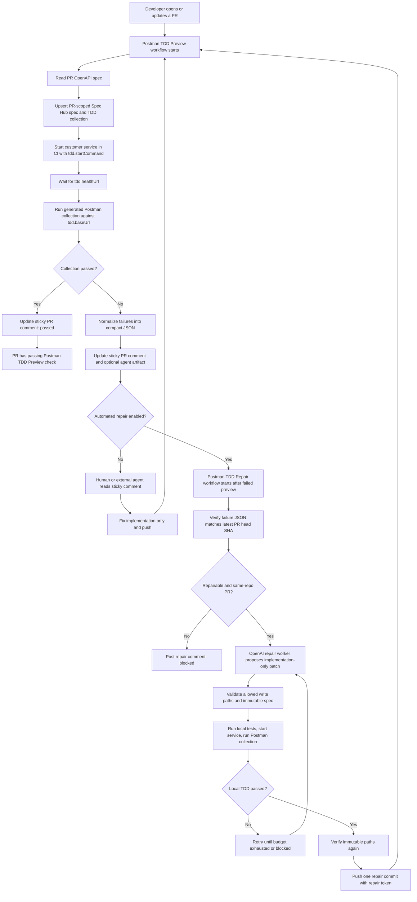

# Postman Onboarding TDD

`postman-onboarding-tdd` is a GitHub Action that turns an OpenAPI change in a pull request into a runnable Postman TDD check.

For each PR, the action:

1. Reads the PR version of your OpenAPI spec.
2. Creates or updates one PR-scoped Spec Hub spec and one generated TDD contract collection in a shared Postman workspace.
3. Starts your service in CI using the command you provide.
4. Runs the generated collection against your local CI service URL.
5. Posts a sticky PR comment with a human-readable summary and compact JSON that coding agents can use.

The optional repair worker can also call OpenAI, make implementation-only changes, run the same Postman collection locally, and push one repair commit only after the local TDD run passes.

## End-To-End Flow



## What Customers Configure

You add three things to the service repository:

1. `.postman-template/onboarding.yml`
2. One script that starts the service for CI TDD
3. One or two GitHub workflows

For most teams, start with the preview workflow first. Add the automated repair workflow after the preview check is stable.

## Repository Config

Create or update `.postman-template/onboarding.yml`:

```yaml
spec:
  path: api/openapi.yaml

service:
  name: reference-service

tdd:
  enabled: true
  workspace:
    name: Reference Service - TDD Preview
    # id is optional on the first run.
    # The action can create/find the workspace and write the id back.
    # id: 00000000-0000-0000-0000-000000000000
  baseUrl: http://127.0.0.1:4010
  healthUrl: http://127.0.0.1:4010/v1/health
  startCommand: ./scripts/postman-tdd-start.sh
  stopCommand: ./scripts/postman-tdd-stop.sh # optional
  timeoutSeconds: 90
```

`startCommand` is customer-owned. It must make the PR implementation reachable at `baseUrl`. It can run the app directly, start Docker Compose, launch mocks, seed data, or do whatever the service needs in CI.

This is how the action stays language- and framework-neutral. Java, Node.js, C#, Python, Docker Compose, and multi-service repos all use the same contract: provide one command that starts the PR implementation locally.

If `tdd.workspace.id` is missing, the action:

1. Looks for exactly one Postman workspace with `tdd.workspace.name`.
2. Creates the workspace if none exists.
3. Fails if multiple exact-name workspaces exist.
4. Writes the workspace ID back to `onboarding.yml` unless `config-write-mode` is `none`.

If the repository does not allow workflow commits back to PR branches, set `config-write-mode: none` and add `tdd.workspace.id` manually after the first workspace is created.

## GitHub Secrets

Create these secrets in the customer service repository:

| Secret | Required | Purpose |
| --- | --- | --- |
| `POSTMAN_API_KEY` | yes | Creates/updates Postman workspace, spec, collection, and runs the collection. |
| `POSTMAN_ACCESS_TOKEN` | no | Compatibility with broader Postman onboarding pipelines. |
| `POSTMAN_TDD_SIGNING_KEY` | recommended | Signs the immutable-spec baseline so agents cannot tamper with sticky comment state. |
| `OPENAI_API_KEY` | repair only | Used by the optional OpenAI repair worker. |
| `POSTMAN_TDD_REPAIR_TOKEN` | repair recommended | PAT or GitHub App token used to push repair commits and trigger the next preview run. |

Use a long random value for `POSTMAN_TDD_SIGNING_KEY`. Implementation agents should not be able to read it.

`POSTMAN_TDD_REPAIR_TOKEN` should be a token that can push to PR branches. A normal `GITHUB_TOKEN` push may not trigger the follow-up workflow run, so production repair should use a PAT or GitHub App token.

## Preview Workflow

Add `.github/workflows/postman-tdd-preview.yml`:

```yaml
name: Postman TDD Preview

on:
  pull_request:
    types: [opened, synchronize, reopened, closed]
    paths:
      - api/**
      - src/**
      - scripts/postman-tdd-start.sh
      - .postman-template/onboarding.yml

permissions:
  contents: write
  pull-requests: write
  issues: write

concurrency:
  group: postman-tdd-pr-${{ github.event.pull_request.number }}
  cancel-in-progress: true

jobs:
  tdd:
    if: github.actor != 'github-actions[bot]'
    runs-on: ubuntu-latest
    steps:
      - uses: actions/checkout@v5
        with:
          ref: ${{ github.event.action == 'closed' && github.base_ref || github.head_ref }}
          fetch-depth: 0

      - uses: postman-cs/postman-onboarding-tdd@main
        with:
          mode: ${{ github.event.action == 'closed' && 'cleanup' || 'run' }}
          postman-api-key: ${{ secrets.POSTMAN_API_KEY }}
          postman-access-token: ${{ secrets.POSTMAN_ACCESS_TOKEN }}
          github-token: ${{ secrets.GITHUB_TOKEN }}
          immutable-state-signing-key: ${{ secrets.POSTMAN_TDD_SIGNING_KEY }}
          workspace-team-id: ${{ vars.POSTMAN_WORKSPACE_TEAM_ID }}
```

Adjust the `paths` list to match the customer repository. At minimum, include the OpenAPI spec, implementation code, startup script, and onboarding config.

On normal PR commits, `mode: run` creates/updates the PR-scoped Postman assets and runs the collection. On PR close, `mode: cleanup` deletes the PR-scoped spec and collection.

## PR Feedback

The preview workflow updates one sticky PR comment titled `Postman TDD Preview`.

On success, it records the passing PR head commit.

On failure, it includes:

- failure phase, such as `collection_run`, `service_startup`, or `health_check`,
- the PR commit that produced the failure,
- immutable paths, usually the OpenAPI spec path,
- compact failure JSON for humans and agents,
- a pointer to the optional `postman-tdd-agent-context` artifact.

Agents should use the sticky comment first. Artifacts are helpful but not required.

Example compact failure:

```json
{
  "operationId": "createWidget",
  "method": "POST",
  "path": "/v1/widgets",
  "assertion": "response body matches schema",
  "message": "Missing required property: owner"
}
```

The success criterion is always:

```text
The latest PR head commit has a passing GitHub check named Postman TDD Preview.
```

## Agent Instructions

Copy this file from this repository into the customer service repository:

```text
.postman-template/tdd-agent.md
```

Commit it to the default branch, usually `main`, so every future PR inherits the same generic instructions.

A human or agent can then use a very small prompt:

```text
Follow .postman-template/tdd-agent.md for this PR.
```

The instructions tell agents to:

- read the latest `Postman TDD Preview` sticky comment,
- compare the failure JSON `commit` to the current PR head SHA,
- fix implementation code only,
- treat `immutablePaths` as read-only,
- push changes,
- wait for the next preview run,
- stop when the latest PR head commit passes or the failure is genuinely blocked.

Do not commit generated `.postman-tdd/` files. Those are run-specific CI artifacts and can become stale after every commit.

## Immutable Spec Guard

Humans can submit OpenAPI spec changes in a PR. Once the TDD failure exists, implementation repair must treat the PR spec as the contract to satisfy.

The action enforces this at workflow level:

1. The preview run records a hash of `spec.path`.
2. The next preview run compares the current spec hash with the previous failure baseline.
3. If an implementation repair changed the spec, the action fails with `immutable_spec`.
4. If `immutable-state-signing-key` is set, the baseline is signed with HMAC-SHA256. A missing or invalid signature fails with `immutable_state_tampered`.

This message is used when the spec changes during implementation repair:

```text
The OpenAPI spec is immutable during implementation repair. Revert spec changes and fix code only.
```

The action also emits an optional CI artifact:

```text
.postman-tdd/
  agent-task.md
  failures.json
  immutable-spec-guard.mjs
```

Agents that can access the artifact may run:

```bash
node .postman-tdd/immutable-spec-guard.mjs snapshot
node .postman-tdd/immutable-spec-guard.mjs verify
```

If artifacts are unavailable, agents should use the inline failure JSON from the sticky comment.

## Optional Local Agent Policy

This repository includes optional templates for agent runtimes that support pre-tool-use hooks:

```text
.postman-template/agent-policy.json
.postman-template/hooks/codex-pre-tool-use.mjs
.postman-template/codex/hooks.json
```

These files are optional. They are local or harness-level prevention, not the final enforcement layer. The GitHub Action immutable-spec guard remains the required enforcement layer.

For Codex-compatible runtimes that execute project hooks, copy the hook config into the customer repository:

```bash
mkdir -p .codex
cp .postman-template/codex/hooks.json .codex/hooks.json
```

Then verify the runtime actually executes hooks before relying on them.

## Optional Automated Repair Worker

The repair worker is opt-in. It is useful when you want the workflow to attempt implementation repair automatically after a failed preview check.

Add repair settings to `.postman-template/onboarding.yml`:

```yaml
tdd:
  repair:
    enabled: true
    provider: openai-responses
    maxAttempts: 3
    allowedWritePaths:
      - src/**
    allowedReadPaths:
      - src/**
      - package.json
      - package-lock.json
    localTestCommand: npm test # optional
```

`allowedWritePaths` is required when repair is enabled. Keep it as narrow as possible.

`allowedReadPaths` defaults to `allowedWritePaths` when omitted.

The worker will not write to:

- the OpenAPI spec path,
- `.postman-template/**`,
- `.postman-tdd/**`,
- `.github/workflows/**`,
- generated Postman files,
- secret-like files.

The OpenAI model does not receive Postman secrets, GitHub tokens, the canonical spec file content, generated collection content, shell access, git access, or raw filesystem write tools.

### Repair Workflow

Add a second workflow, `.github/workflows/postman-tdd-repair.yml`:

For `workflow_run` triggers, GitHub uses the workflow definition from the default branch. Merge this repair workflow to the default branch before expecting it to run automatically for PR failures.

```yaml
name: Postman TDD Repair

on:
  workflow_run:
    workflows: [Postman TDD Preview]
    types: [completed]

permissions:
  contents: write
  pull-requests: write
  issues: write

concurrency:
  group: postman-tdd-repair-${{ github.event.workflow_run.head_branch }}
  cancel-in-progress: true

jobs:
  repair:
    if: >
      github.event.workflow_run.conclusion == 'failure' &&
      github.event.workflow_run.event == 'pull_request' &&
      github.event.workflow_run.pull_requests[0].number
    runs-on: ubuntu-latest
    steps:
      - uses: actions/checkout@v5
        with:
          ref: ${{ github.event.workflow_run.head_branch }}
          fetch-depth: 0

      - uses: postman-cs/postman-onboarding-tdd@main
        with:
          mode: repair
          pr-number: ${{ github.event.workflow_run.pull_requests[0].number }}
          postman-api-key: ${{ secrets.POSTMAN_API_KEY }}
          postman-access-token: ${{ secrets.POSTMAN_ACCESS_TOKEN }}
          github-token: ${{ secrets.GITHUB_TOKEN }}
          repair-github-token: ${{ secrets.POSTMAN_TDD_REPAIR_TOKEN }}
          openai-api-key: ${{ secrets.OPENAI_API_KEY }}
          immutable-state-signing-key: ${{ secrets.POSTMAN_TDD_SIGNING_KEY }}
          workspace-team-id: ${{ vars.POSTMAN_WORKSPACE_TEAM_ID }}
```

The repair worker:

1. Reads the latest preview sticky comment.
2. Blocks if the failure JSON is stale.
3. Blocks fork PRs.
4. Blocks unsupported phases such as config, workspace, immutable-state, or immutable-spec failures.
5. Allows repair for `collection_run`, `service_startup`, and `health_check`.
6. Lets OpenAI use guarded read/search/patch tools only.
7. Runs `localTestCommand` when configured.
8. Starts the service and runs the Postman TDD collection locally.
9. Verifies immutable paths and allowed write paths.
10. Pushes one repair commit only after the local Postman collection passes.

The worker posts a separate sticky PR comment titled `Postman TDD Repair`. It does not overwrite the preview comment.

## Action Inputs

| Input | Required | Default | Description |
| --- | --- | --- | --- |
| `mode` | no | `run` | `run`, `cleanup`, or `repair`. |
| `onboarding-config-path` | no | `.postman-template/onboarding.yml` | Service onboarding config path. |
| `project-name` | no | `service.name` | Optional service name override. |
| `spec-path` | no | `spec.path` | Optional OpenAPI spec path override. |
| `pr-number` | no | pull request event number | Optional PR number override. Recommended for `workflow_run` repair workflows. |
| `postman-api-key` | yes | | Postman API key. |
| `postman-access-token` | no | | Compatibility input for broader onboarding pipelines. |
| `github-token` | yes | | Token for PR comments and workspace ID config writeback. |
| `immutable-state-signing-key` | no | | HMAC key used to sign immutable spec baselines. Recommended value: `${{ secrets.POSTMAN_TDD_SIGNING_KEY }}`. |
| `workspace-team-id` | no | | Numeric Postman sub-team ID for org-mode workspace creation. |
| `config-write-mode` | no | `commit-and-push` | `commit-and-push`, `commit-only`, or `none`. |
| `committer-name` | no | `Postman` | Commit author name for workspace ID writeback. |
| `committer-email` | no | `support@postman.com` | Commit author email for workspace ID writeback. |
| `postman-region` | no | `us` | `us` or `eu`. |
| `postman-stack` | no | `prod` | `prod` or `beta`. |
| `openai-api-key` | repair only | | OpenAI API key for `mode: repair`. |
| `repair-github-token` | repair recommended | `github-token` | Token used by `mode: repair` for pushing repair commits. Prefer a PAT or GitHub App token. |
| `repair-provider` | no | `openai-responses` | Repair provider. V1 only accepts `openai-responses`. |
| `repair-model` | no | `gpt-5.5` | OpenAI model used by `mode: repair`. |
| `repair-max-attempts` | no | `3` | Maximum accepted implementation patch attempts. |
| `repair-commit-message` | no | `Postman TDD repair` | Commit message used for a passing repair commit. |

## Action Outputs

Important preview outputs:

| Output | Description |
| --- | --- |
| `status` | `passed`, `failed`, `skipped`, or `cleaned-up`. |
| `failure-phase` | Failure phase, such as `collection_run`, `service_startup`, `health_check`, `immutable_spec`, or `immutable_state_tampered`. |
| `workspace-id` | Shared TDD preview workspace ID. |
| `spec-id` | PR-scoped Spec Hub spec ID. |
| `tdd-collection-id` | PR-scoped generated collection ID. |
| `pr-comment-id` | Sticky preview PR comment ID. |
| `agent-context-artifact` | Uploaded agent context artifact name, when available. |

Important repair outputs:

| Output | Description |
| --- | --- |
| `repair-status` | `repaired`, `blocked`, `skipped`, or `failed`. |
| `repair-blocked-reason` | Machine-readable reason when repair is blocked. |
| `repair-attempts` | Number of accepted implementation patch attempts. |
| `repair-commit-sha` | Commit SHA pushed by the repair worker after a passing local collection run. |
| `repair-summary-path` | Local JSON summary path. |

## Development

For contributors to this action:

```bash
npm install
npm test
npm run typecheck
npm run build
npm run check:dist
```
